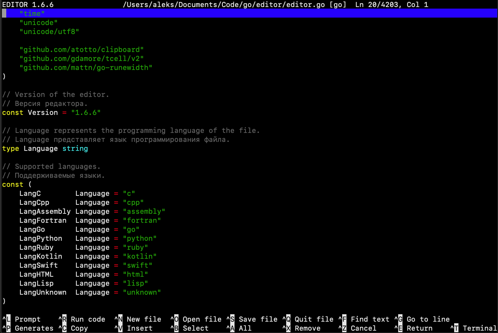

# editor
# Text Editor

[](LICENSE)
[](
https://golang.org/dl/)

It is a text editor for working in the terminal, written in the Go language, using the tcell/v2 library for working with the terminal. It supports basic editing functions, syntax highlighting for multiple programming languages, and integration with LLM (Large Language Models).


## Features

* **Text editing:** Multi-line editing, keyboard navigation (arrows, Home, End, PgUp, PgDn), insert, delete, create and open files.
* **Syntax highlighting:** Syntax highlighting support for the following languages: C, C++, Assembly, Fortran, Go, Python, Ruby, Kotlin, Swift, HTML, Lisp.
*   **Search:** Search for text in a file.
* **Navigation:** Jump to a specific line.
* **Cancel/Repeat:** Support for Undo and Redo operations.
* **Clipboard:** Cutting, copying, and pasting text (using the system clipboard via the atotto/clipboard library).
* **Integration with LLM:** The ability to send instructions and text from the editor to interact with LLM. Data from the clipboard can be automatically added to the request.
* **Status bar:** Displays the file name, language, row and column numbers, as well as keyboard shortcuts.

## Installation

1. Make sure you have Go installed (https://golang.org/dl /).
2. Install the necessary dependencies:
``bash
    go mod init <module name> # If you are creating a new module
    go get github.com/atotto/clipboard
    go get github.com/gdamore/tcell/v2
    go get github.com/mattn/go-runewidth
    ``
(Or just use `go mod tidy` if `go.mod` already exists).
3. Compile the program:
    ```bash
    go build -o editor main.go # Replace main.go to the path to the code file if it is different.
    ```
    
## Usage

Run the compiled file:

``bash
./editor [provider] [model] [file] [--key {key}]
``
provider {default: ollama}, model {default: gemma3:4b}
### Flags

* `string': LLM provider (by default, it is taken from the environment variable `LLM_PROVIDER`).
*   `string`: The LLM model (by default, it is taken from the environment variable `LLM_MODEL`).
* `string': The path to the file to open.
* `--key {key}`: Key LLM provider
* `-v, -version': Show the editor version.
* `-h, --help`: Show extended help.

If the file path is not specified in the flags, it can be passed as the first command line argument.

### Keyboard shortcuts

- Arrows: move the cursor
- Home/End, PgUp/PgDn: text navigation
- Ctrl-A: highlight everything (and other selection options)
- Ctrl-F: text search
- Ctrl-G: go to the line
- Ctrl-S: save the file
- Ctrl-O: open the file
- Ctrl-N: new file
- Ctrl-Q: exit
- Ctrl-X: cut the current line
- Ctrl-C: copy to clipboard
- Ctrl-V: paste from clipboard
- Ctrl-P: generate text/code based on the description
- Ctrl-L: send a request to LLM (and insert a response)
- Ctrl-B Select line by line (from the cursor)
- Ctrl-P Generates the program code based on the description
- Ctrl-R Launches the program code
- Ctrl-T OS Terminal


## Version

Current version: 1.6.8

## Dependencies

*   `github.com/atotto/clipboard`
*   `github.com/gdamore/tcell/v2`
*   `github.com/mattn/go-runewidth`

## License

This project is licensed under the BSD 3-Clause license - for details, see the [LICENSE](LICENSE) file.

## Notes

* The code contains comments in Russian.
* The editor has a fixed window size (115x34), defined in the code (`contentWidth`, `contentHeight`).
* The program code was checked on macOS 15 OS.6 

## Contact information

If you have any questions or suggestions, please contact: [skala.skalolaz.1970@gmail.com ]

See [CREDITS.md ](CREDITS.md ) — acknowledgements and information about addictions.

# editor
# Текстовый редактор

Это текстовый редактор для работы в терминале, написанный на языке Go, с использованием библиотеки `tcell/v2` для работы с терминалом. Он поддерживает основные функции редактирования, синтаксическую подсветку для множества языков программирования и интеграцию с LLM (Large Language Models).

## Возможности

*   **Редактирование текста:** Многострочное редактирование, навигация с помощью клавиш (стрелки, Home, End, PgUp, PgDn), вставка, удаление, создание и открытие файлов.
*   **Синтаксическая подсветка:** Поддержка подсветки синтаксиса для следующих языков: C, C++, Assembly, Fortran, Go, Python, Ruby, Kotlin, Swift, HTML, Lisp.
*   **Поиск:** Поиск текста по файлу.
*   **Навигация:** Переход к определенной строке.
*   **Отмена/повтор:** Поддержка операций отмены (`Undo`) и повтора (`Redo`) действий.
*   **Буфер обмена:** Вырезание, копирование и вставка текста (используется системный буфер обмена через библиотеку `atotto/clipboard`).
*   **Интеграция с LLM:** Возможность отправки инструкций и текста из редактора для взаимодействия с LLM. Данные из буфера обмена могут автоматически добавляться к запросу.
*   **Статусная строка:** Отображение имени файла, языка, номера строки и столбца, а также подсказок по горячим клавишам.

## Установка

1.  Убедитесь, что у вас установлен Go (https://golang.org/dl/).
2.  Установите необходимые зависимости:
    ```bash
    go mod init <название_модуля> # Если вы создаете новый модуль
    go get github.com/atotto/clipboard
    go get github.com/gdamore/tcell/v2
    go get github.com/mattn/go-runewidth
    ```
    (Или просто используйте `go mod tidy` если `go.mod` уже существует).
3.  Скомпилируйте программу:
    ```bash
    go build -o editor main.go # Замените main.go на путь к файлу с кодом, если он другой
    ```
    
## Использование

Запустите скомпилированный файл:

```bash
./editor  [провайдер] [модель] [файл] [--key {key}]
```
провайдер {default: ollama}, модель {default: gemma3:4b}
### Флаги

*   `string`: Провайдер LLM (по умолчанию берется из переменной окружения `LLM_PROVIDER`).
*   `string`: Модель LLM (по умолчанию берется из переменной окружения `LLM_MODEL`).
*   `string`: Путь к файлу для открытия.
*   * `--key {key}`: Ключ иного LLM провайдера
*   `-v, -version`: Показать версию редактора.
*   `-h, --help`: Показать расширенную справку.

Если путь к файлу не указан в флагах, его можно передать как первый аргумент командной строки.

### Горячие клавиши

- Стрелки: перемещение курсора
- Home/End, PgUp/PgDn: навигация по тексту
- Ctrl-A: выделение всего (и другие варианты выделения)
- Ctrl-F: поиск текста
- Ctrl-G: перейти к строке
- Ctrl-S: сохранить файл
- Ctrl-O: открыть файл
- Ctrl-N: новый файл
- Ctrl-Q: выход
- Ctrl-X: вырезать текущую строку
- Ctrl-C: копировать в буфер обмена
- Ctrl-V: вставить из буфера обмена
- Ctrl-P: сгенерировать текст/код на основе описания
- Ctrl-L: отправить запрос к LLM (и вставить ответ)
- Ctrl-B  Выделить по строчно (от курсора)
- Ctrl-P  Генерирует код программы на основе описания
- Ctrl-R  Запускает код программы
- Ctrl-T  Терминал ОС


## Версия

Текущая версия: 1.6.8

## Зависимости

*   `github.com/atotto/clipboard`
*   `github.com/gdamore/tcell/v2`
*   `github.com/mattn/go-runewidth`

## Лицензия

Этот проект лицензирован по лицензии BSD 3-Clause - подробности см. в файле [LICENSE](LICENSE).

## Примечания

*   Код содержит комментарии на русском языке.
*   Редактор имеет фиксированный размер окна (115x34), определяемый в коде (`contentWidth`, `contentHeight`).
*   Проверка кода программы была произведена на ОС macOS 15.6 

## Контактная информация

Если есть вопросы или предложения обращайтесь по адресу: [skala.skalolaz.1970@gmail.com]

Смотрите [CREDITS.md](CREDITS.md) — благодарности и информация о зависимостях.
